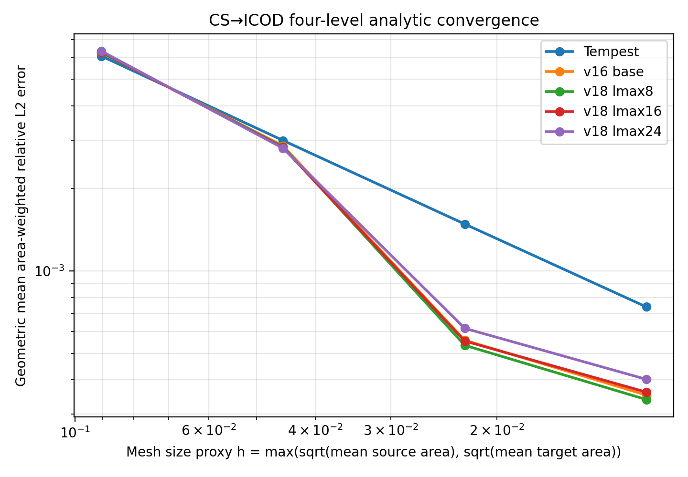
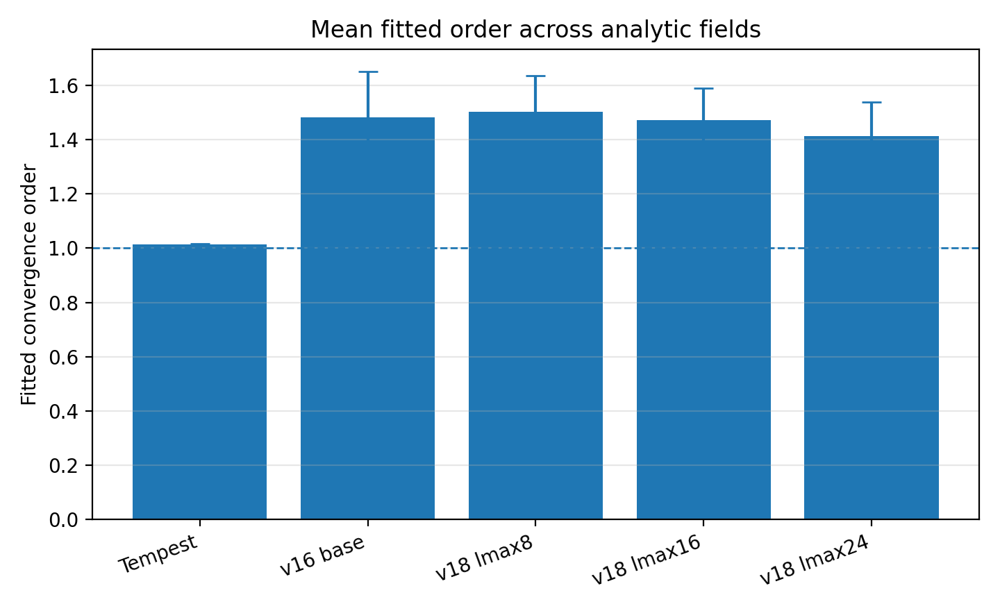
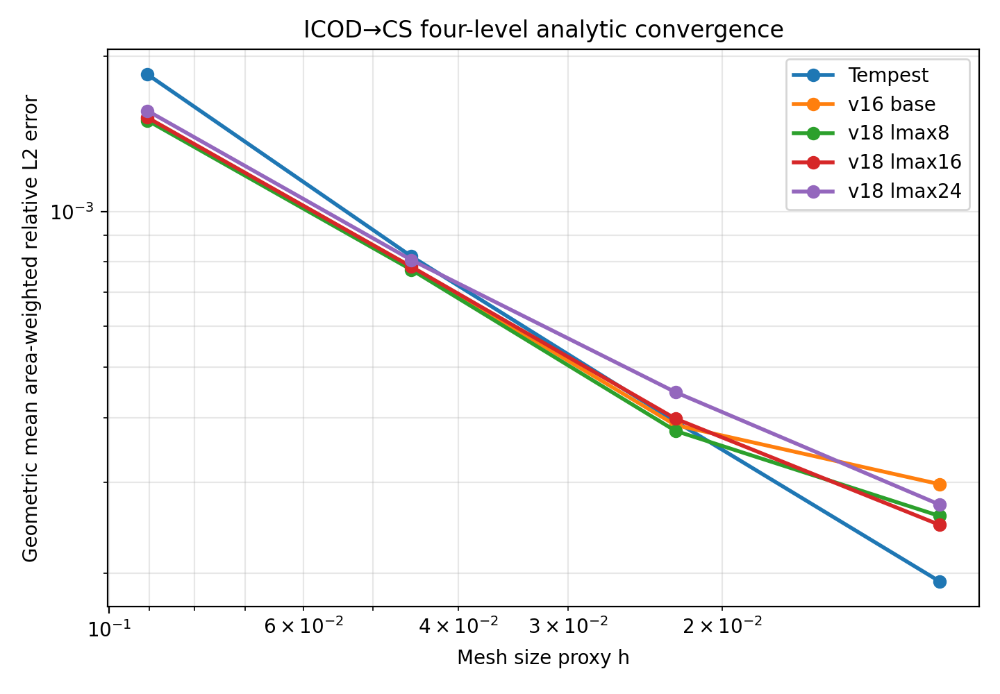
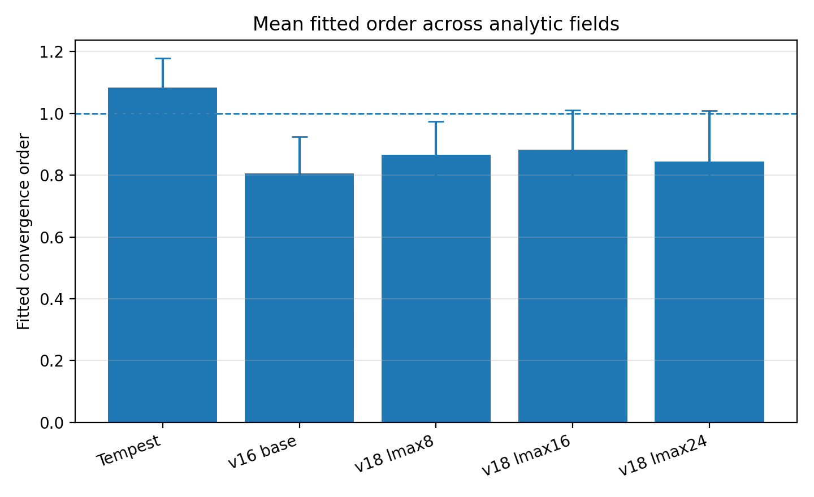
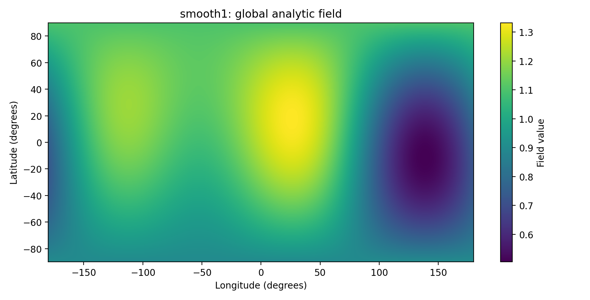
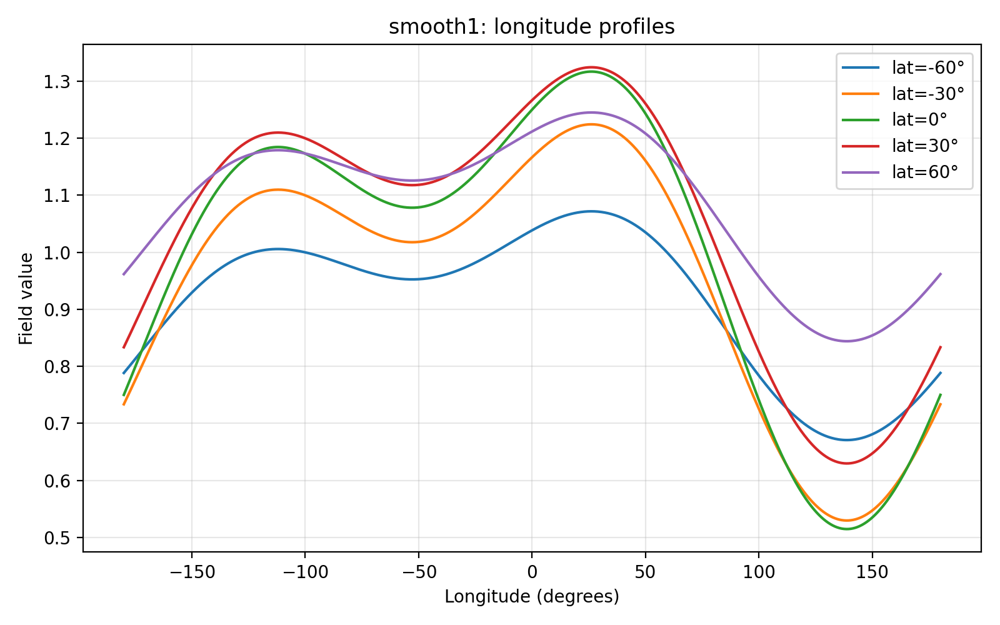
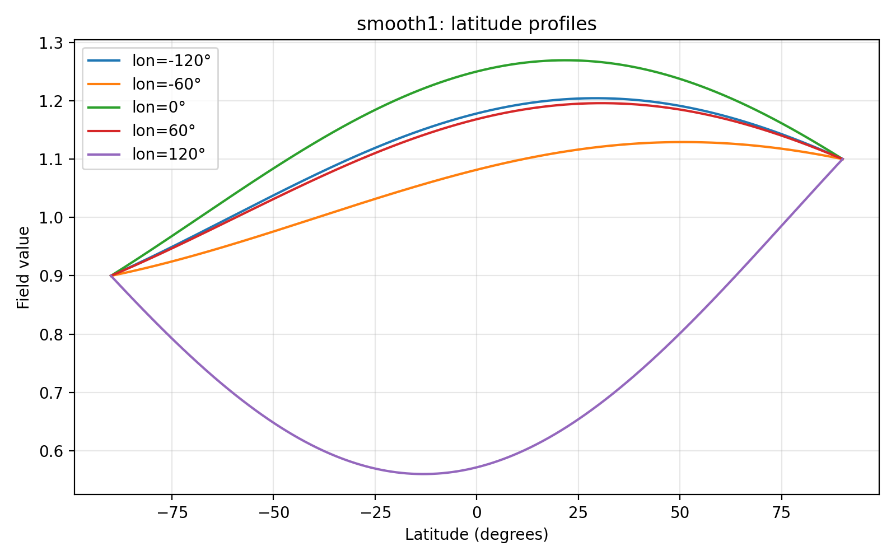
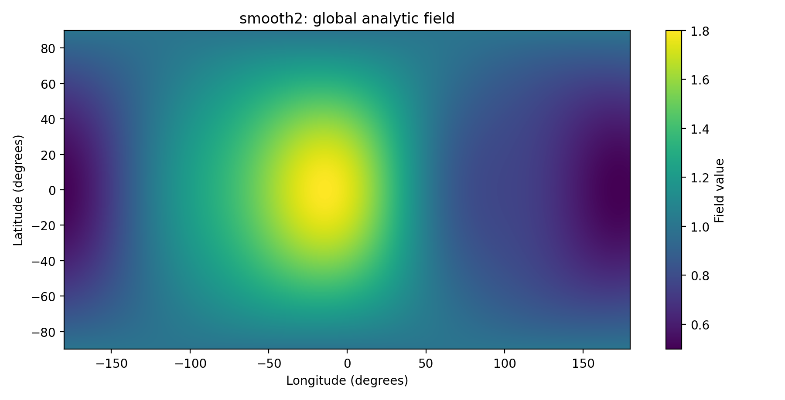
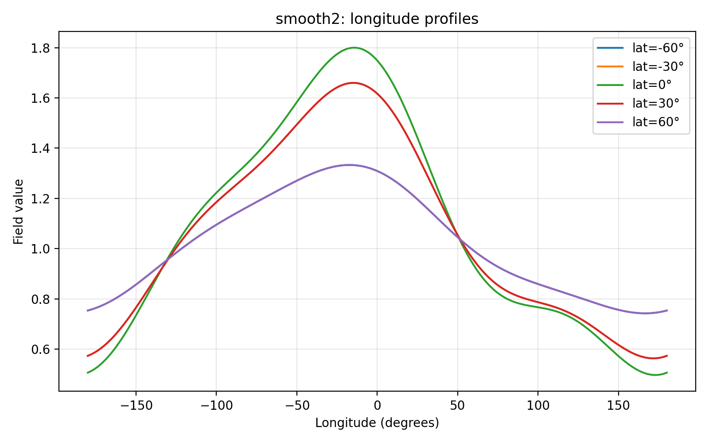
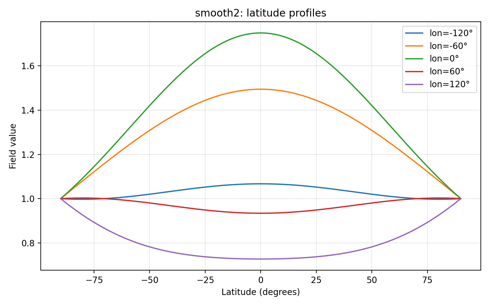

# Analytic refinement convergence study

This experiment checks whether the learned conservative remapper behaves like a convergent numerical method under mesh refinement.

## Setup

We use a four-level CS to ICOD refinement:

| Level | Pair |
|---:|---|
| 1 | `CS-r16_to_ICOD-r16` |
| 2 | `CS-r32_to_ICOD-r32` |
| 3 | `CS-r64_to_ICOD-r64` |
| 4 | `CS-r128_to_ICOD-r128` |

For each level, analytic fields are evaluated on the source mesh, remapped to the target mesh, and compared against analytic target values using area-weighted relative L2 error.

We use the following mesh size proxy:

`h = max(sqrt(mean source cell area), sqrt(mean target cell area))`

We estimate the convergence order by fitting a line to `log(error)` versus `log(h)` across all four levels.

## Analytic fields

The smooth analytic test suite is:

- `x`
- `y`
- `z`
- `smooth1`
- `smooth2`

## Fitted convergence orders

| Method / stage | Mean fitted order | Min | Max | Mean R² |
|---|---:|---:|---:|---:|
| Tempest | 1.014 | 1.012 | 1.016 | 0.99998 |
| v16 base | 1.481 | 1.324 | 1.652 | 0.9535 |
| v18 corrected `lmax=8` | 1.504 | 1.412 | 1.637 | 0.9530 |
| v18 corrected `lmax=16` | 1.472 | 1.375 | 1.591 | 0.9530 |
| v18 corrected `lmax=24` | 1.412 | 1.320 | 1.538 | 0.9574 |

## Figures

## Curated result files

Curated result files are in `analysis_medium_improv/github_results/`.

Key files:

- `convergence_CS_to_ICOD_4level_tempest_smooth.csv`
- `convergence_CS_to_ICOD_4level_tempest_smooth_slopes.csv`
- `convergence_CS_to_ICOD_4level_v18_trajectory_smooth.csv`
- `convergence_CS_to_ICOD_4level_v18_trajectory_smooth_slopes.csv`
- `convergence_CS_to_ICOD_4level_stage_summary.csv`

## Reverse direction: ICOD to CS

We also ran the same four-level diagnostic in the reverse direction:

| Level | Pair |
|---:|---|
| 1 | `ICOD-r16_to_CS-r16` |
| 2 | `ICOD-r32_to_CS-r32` |
| 3 | `ICOD-r64_to_CS-r64` |
| 4 | `ICOD-r128_to_CS-r128` |

The model struggled a little more.

| Method / stage | Mean fitted order | Min | Max | Mean R² |
|---|---:|---:|---:|---:|
| Tempest | 1.083 | 1.032 | 1.179 | 0.9989 |
| v16 base | 0.806 | 0.662 | 0.925 | 0.9180 |
| v18 corrected `lmax=8` | 0.866 | 0.748 | 0.975 | 0.9445 |
| v18 corrected `lmax=16` | 0.882 | 0.776 | 1.010 | 0.9634 |
| v18 corrected `lmax=24` | 0.844 | 0.709 | 1.009 | 0.9686 |

The learned conservative remapper shows first-order-or-better aggregate convergence for CS→ICOD, but sub-first-order aggregate convergence for ICOD→CS.

## Analytic test field profiles

The convergence test fields `smooth1` and `smooth2` are synthetic analytic functions, not MIRA physical fields. They are evaluated directly from the spherical mesh coordinates.

For unit-sphere Cartesian coordinates `(x, y, z)` with longitude `lon` and latitude `lat`:

- `smooth1 = 1 + 0.25x - 0.15y + 0.10z + 0.20 sin(2 lon) cos(lat)`
- `smooth2 = exp(0.5x - 0.25y) + 0.10 cos(3 lon) cos^2(lat)`

These fields were chosen to be smooth, nontrivial, and independent of the MIRA training/evaluation variables.

### smooth1

### smooth2

